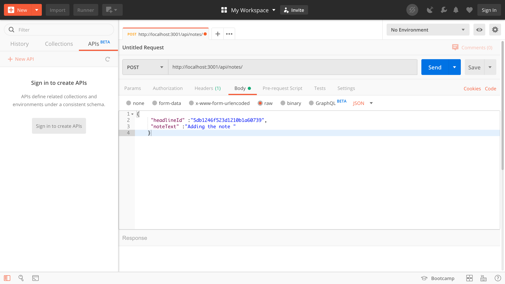
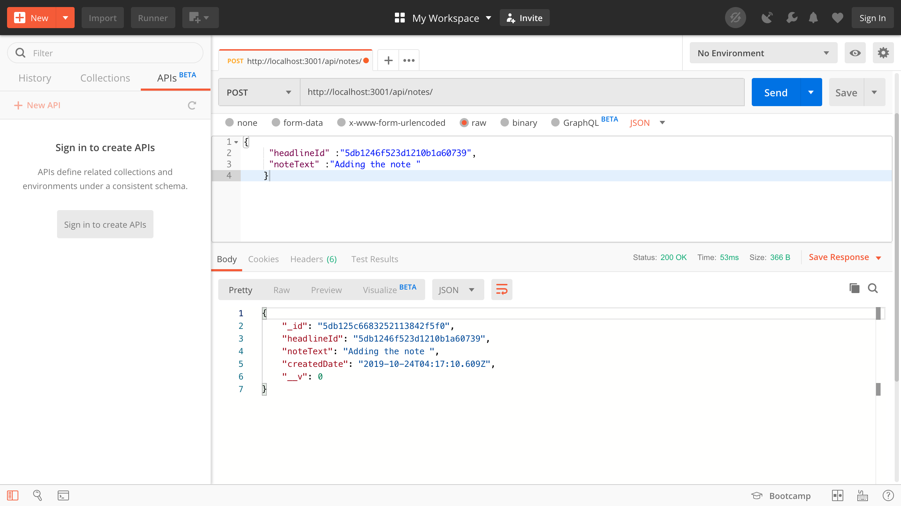
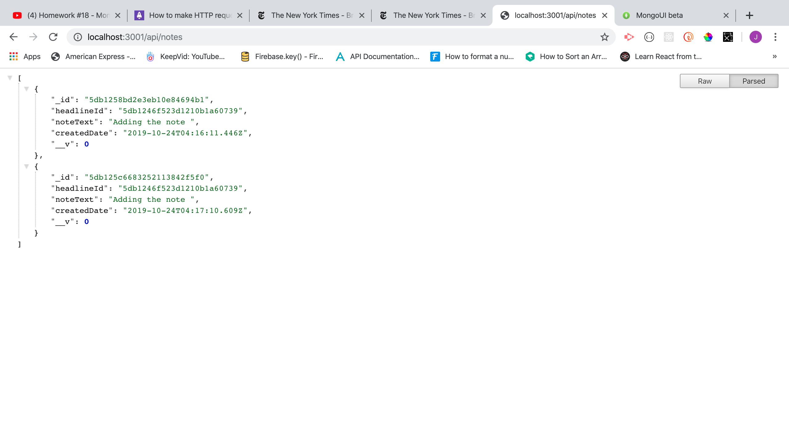
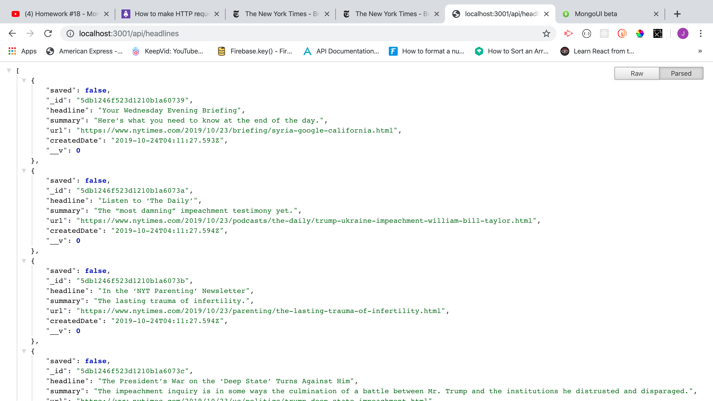

# Steps for creating a MERN Stack App

- Jogeswararaos-MacBook-Pro:GitHub jogeswararaokolla\$ mkdir mern-app-scrape-articles
- Jogeswararaos-MacBook-Pro:GitHub jogeswararaokolla\$ cd mern-app-scrape-articles

* Create client front app folder using create-react-app

- Jogeswararaos-MacBook-Pro:mern-app-scrape-articles jogeswararaokolla\$ create-react-app client

* Remote the .git file in the client folder as create-react-app creates a git repository.
  We wanted to maintain this at application level I.e. folder mern-app-scrape-articles
* Install the front dependencies

- Jogeswararaos-MacBook-Pro:client jogeswararaokolla\$ npm install axios cheerio

* Jogeswararaos-MacBook-Pro:client jogeswararaokolla\$ rm -rf .git

- Jogeswararaos-MacBook-Pro:client jogeswararaokolla\$rm -rf .gitignore
- Create backend server.js and respective directories at app level folder mern-app-scrape-articles
- Jogeswararaos-MacBook-Pro:mern-app-scrape-articles jogeswararaokolla\$ mkdir models routes controllers scripts && touch server.js
- Jogeswararaos-MacBook-Pro:mern-app-scrape-articles jogeswararaokolla\$ touch models/index.js routes/index.js controllers/index.js scripts/index.js
- Install backend dependencies packages at application level mern-app-scrape-articles
- Jogeswararaos-MacBook-Pro:mern-app-scrape-articles jogeswararaokolla\$ npm init -y

* Install backend dependencies

- Jogeswararaos-MacBook-Pro:mern-app-scrape-articles jogeswararaokolla\$ npm i express mongoose concurrently if-env

- Add "proxy": "http://localhost:3001", to client folder package.json

* Make the application folder as GIT Repository and add the remote to push the code to master

- Jogeswararaos-MacBook-Pro:mern-app-scrape-articles jogeswararaokolla$ git init
Initialized empty Git repository in /Users/jogeswararaokolla/Documents/GitHub/mern-app-scrape-articles/.git/
Jogeswararaos-MacBook-Pro:mern-app-scrape-articles jogeswararaokolla$

- Add the below code to package.json at app level
  "scripts": {
  "start": "if-env NODE_ENV=production && npm run start:prod || npm run start:dev",
  "start:prod": "node server.js",
  "start:dev": "concurrently \"node server.js\" \"cd client && npm start\"",
  "client": "cd client && npm run start",
  "seed": "node scripts/seedDB.js",
  "install": "cd client && npm install",
  "build": "cd client && npm run build",
  "heroku-postbuild": "npm run build"
  },

* add the Remote the project in git

- Jogeswararaos-MacBook-Pro:mern-app-scrape-articles jogeswararaokolla\$ git remote -v
- Jogeswararaos-MacBook-Pro:mern-app-scrape-articles jogeswararaokolla\$ git remote add origin https://github.com/JogeswararaoKolla/mern-app-scrape-articles.git

* Jogeswararaos-MacBook-Pro:mern-app-scrape-articles jogeswararaokolla\$ git remote -v
  origin https://github.com/JogeswararaoKolla/mern-app-scrape-articles.git (fetch)
  origin https://github.com/JogeswararaoKolla/mern-app-scrape-articles.git (push)

- Jogeswararaos-MacBook-Pro:mern-app-scrape-articles jogeswararaokolla\$

* push an existing repository from the command line

- git remote add origin https://github.com/JogeswararaoKolla/mern-app-scrape-articles.git
- git push -u origin master

- Backend API TESTING Results

